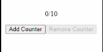

# Counter-React-JS
> English not my first language

Simple React JS page that displays a counter.

## Table of contents
- [Introduction](#introduction)
- [Technologies](#technologies)
- [Illustrations](#illustrations)

## Introduction
This project is a practice for introduction to events (In this case, _onClick_) in React JS. It's a simple counter with buttons to make it go up or down, and disabling buttons when the upper limit or lower limit is reached.

## Technologies
- NodeJS v15.8.0

## Illustrations

